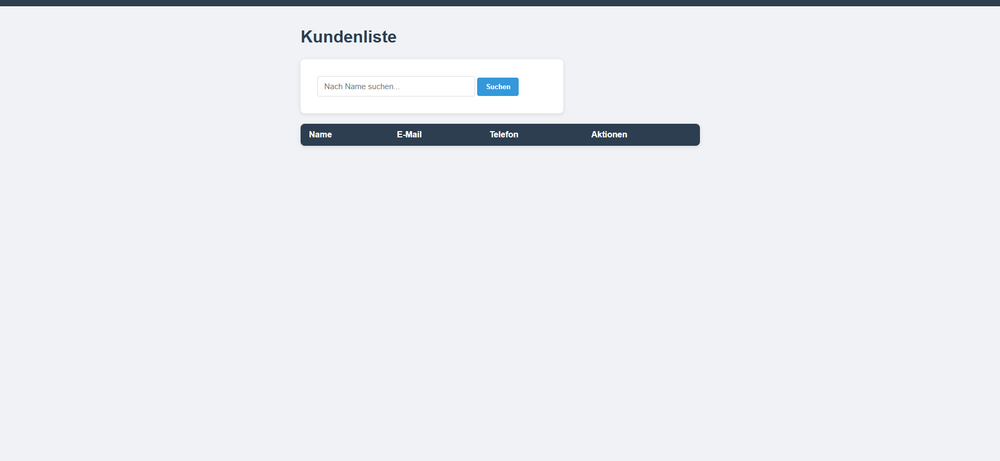

# CRM-System

Ein webbasiertes CRM-System (Customer Relationship Management) gebaut mit Python und Flask.

## Funktionen

- Kunden hinzufügen, bearbeiten und löschen
- Kundensuche nach Name
- Dauerhafte Speicherung in SQLite-Datenbank
- Professionelles responsives Design

## Technologien

- Python 3
- Flask
- SQLite
- HTML/CSS

## Installation

1. Repository klonen:
   git clone https://github.com/Noah-Winner/crm-flask.git

2. In den Projektordner wechseln:
   cd crm-flask

3. Flask installieren:
   python -m pip install flask

4. App starten:
   python app.py

5. Im Browser öffnen:
   http://127.0.0.1:5000

## Screenshots

## Autor

Noah – Web-Entwickler & KI-Automatisierung